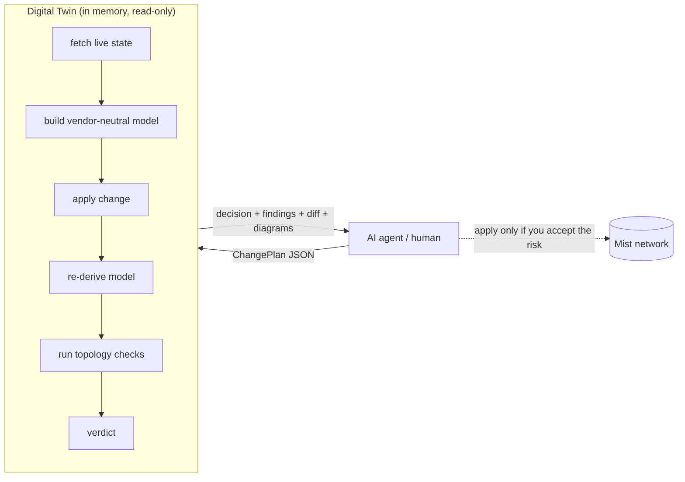

# Network Digital Twin

A **simulate-before-apply safety gate** for [Juniper Mist](https://www.mist.com) networks.

An AI agent (or a human) proposes a configuration change as a JSON **ChangePlan**.
The twin fetches the live network state (read-only), builds a vendor-neutral model,
applies the change **in memory**, re-derives the model, runs topology checks, and
returns a **verdict** — before anything touches the network.



```text
decision: UNSAFE
severity: ERROR
  reason: wired.l2.blackhole.exit_lost: vlan 30: member segment loses its path to the irb exit
  check wired.l2.loop: pass (coverage=complete)
  check wired.l2.blackhole: fail (coverage=complete)
  check wired.l2.vlan_segmentation: warn (coverage=complete)
  check wired.client.impact: warn (coverage=complete)
  finding [error] wired.l2.blackhole.exit_lost: vlan 30: member segment loses its path to the irb exit
  finding [warning] wired.client.impact.active_clients: 3 currently-connected client(s) affected by the delta
  state: api.mist.com @ 2026-06-10T05:07:44+00:00 (age 2s)
  trace: 7c1b9e2f40aa
```

The twin **only simulates** — applying changes is a separate, deferred module.

A new importable [behavioral engine foundation](docs/behavioral-engine.md) adds
immutable multi-site batches, exact coverage receipts, symbolic packet evaluation,
and bounded EX/SRX/SSR primitives alongside this check engine. Run its offline
coupled WLAN + wired example with `uv run --frozen python -m digital_twin.behavioral.demo`.
Production Mist-to-behavior compilation and the full-stack runtime model remain open.

## Why this matters (especially with AI agents and MCP)

Mist (like most cloud network controllers) will happily accept a syntactically
valid configuration change and push it to the live fabric. What it **does not**
tell you is the *network-level* consequence: schema validation confirms a payload
is well-formed, not that flipping an AP's uplink from trunk to access will strand
a WLAN's VLAN, that removing a switch's only uplink will black-hole a subnet, or
that cutting PoE will drop the APs behind that port and every client on them.

That gap is dangerous in two situations this project targets:

- **AI-driven configuration.** When an agent edits the network through an
  [MCP](https://modelcontextprotocol.io) tool (or any LLM-backed automation),
  there is no human eyeballing each `PUT`. Agents produce *plausible* changes,
  and plausible-but-wrong changes apply silently. An agent needs a deterministic
  "will this break the network?" oracle it can call **before** committing — and
  one that fails closed.
- **High blast radius, low reversibility.** A single root-attribute replace can
  redefine a VLAN, sever an uplink, withdraw an L3 exit, or remove the only DHCP
  path — affecting clients that are connected *right now*. "Apply and watch" is
  not an acceptable rollback strategy on a production fabric.

The digital twin is the missing pre-flight check. It predicts the impact of a
change on the *modeled network*, not just the payload, and it is built around one
non-negotiable doctrine:

> **A blind spot can never resolve to SAFE.**

If the twin cannot fully see or fully trust some part of the change, it says so
(`REVIEW`/`UNKNOWN`) rather than guessing green. That property is what makes it
safe to wire into an autonomous or assistive agent: the worst it can do is be
*too cautious*, never falsely reassuring.

## The verdict contract

The single field an agent acts on is `decision`, with strict precedence
(`UNKNOWN > UNSAFE > REVIEW > SAFE`):

| Decision | Meaning | Exit code |
|---|---|---|
| `UNKNOWN` | Could not simulate this (unsupported scope, fetch failure, fatal payload). Do not apply, do not assume safe. | 30 |
| `UNSAFE` | This will break something — a network finding at ERROR/CRITICAL with HIGH confidence. | 20 |
| `REVIEW` | Possible issue **or a blind spot** (warning, missing data, partial coverage, non-HIGH confidence). A human/agent must look. | 10 |
| `SAFE` | Fully evaluated, fully covered, high confidence, clean. | 0 |

The core invariant: **a blind spot can never resolve to SAFE.** Every conclusion
carries coverage (*did I look at it?*) and confidence (*how much do I trust it?*)
as separate axes, and anything below "complete + HIGH" floors the decision to
REVIEW. Findings carry evidence, affected entities, stable machine codes, and a
pointer to the changed entity that caused them.

## What you get

A verdict is more than a yes/no. Each one bundles three kinds of value.

### 1. Visibility — see the change and its blast radius

- **Configuration diff** (`config_diffs`) — every changed leaf as a
  `FieldChange` (`path`, `before`, `after`, `kind` = added/removed/changed),
  so you can show *exactly* what the change does to the raw Mist config. Secrets
  and sensitive values are **redacted inline**; the diff is empty on `UNKNOWN`
  (the honesty gate — never a diff the verdict didn't actually evaluate).
- **Topology diagrams** (`diagrams`) — [mermaid](https://mermaid.js.org/) charts
  of the proposed state (L2, per-VLAN, routed-VLAN exits) with the blast radius
  severity-highlighted and the cause captioned. Render them in any markdown
  surface (including an MCP elicitation UI).
- **Affected clients** — `wired.client.impact` lists the wired **and** wireless
  clients connected *right now* that fall in the blast radius, enriched with
  identity (hostname / manufacturer / model / OS / auth), derived subnet, and
  DHCP-touch signals.
- **Provenance & freshness** (`state_meta`, `trace_ref`) — which source the
  state came from, how old it is, and a trace id to replay the exact run.

### 2. Analysis — a model, not a string match

- **Vendor-neutral IR** — devices, ports, links, VLANs, L3 exits, DHCP scopes,
  WLANs, NAC rules, and clients, each fact tagged with **categorical confidence**
  (HIGH/MEDIUM/LOW — never a float) and provenance. Derived conclusions take the
  MIN of their inputs.
- **Coverage × confidence** — every conclusion reports *did I look at it?* and
  *how much do I trust it?* as separate axes, so a REVIEW always tells you whether
  it's "found a problem" or "couldn't see clearly."
- **Cause attribution** (`Finding.caused_by`) — each delta-driven finding names
  the changed entity (port / link / device / L3 interface / DHCP scope) and the
  IR fields that changed, so "vlan 30 lost its exit" points back to the exact port
  you edited.

### 3. Validations — what it actually checks

The twin ships **34 checks** over the IR. The **32 wired/wireless checks** run on
site plans (and the org-template fan-out); the **2 NAC checks** run on org-NAC
plans. Each is **delta-aware**: a finding *introduced* by the change gates the
verdict; a pre-existing condition the change merely touches is reported as
context and never floors an unrelated edit.

| # | Domain | Check | What it catches |
|---|---|---|---|
| 1 | L2 / switching | `wired.l2.loop` | a cycle that STP is not protecting |
| 2 | L2 / switching | `wired.l2.blackhole` | a VLAN segment that loses its path to its L3 exit |
| 3 | L2 / switching | `wired.l2.isolation` | a member/client segment physically severed from its L2 domain |
| 4 | L2 / switching | `wired.l2.vlan_segmentation` | a broadcast-domain shape change |
| 5 | L2 / switching | `wired.l2.native_mismatch` | link ends disagreeing on the native VLAN (silent untagged leak) |
| 6 | L2 / switching | `wired.l2.mtu_mismatch` | link ends disagreeing on MTU (silent large-frame drops) |
| 7 | L2 / switching | `wired.l2.vlan_collision` | the same VLAN ID minted under two names |
| 8 | L1 / physical | `wired.l1.link_param_mismatch` | incompatible speed/duplex/autoneg across a link (invisible to reachability, wrecks throughput) |
| 9 | Spanning tree | `wired.stp.edge_on_uplink` | BPDU-drop / edge landing on a switch-to-switch link |
| 10 | Spanning tree | `wired.stp.root_change` | the change re-elects a component's root bridge |
| 11 | Spanning tree | `wired.stp.policy` | an STP policy knob changed (`stp_required`/`stp_no_root_port`/`stp_p2p`/`use_vstp`); floors REVIEW — the bridge domain is not provable — SAFE only under the Spec-6 telemetry-validated inertness license (stable-state claim) |
| 12 | L3 / routing | `wired.l3.gateway_gap` | a routed network with no L3 interface / an unowned gateway |
| 13 | **L3 / routing — OSPF** | `wired.l3.ospf_withdrawal` | OSPF participation withdrawn or mutated (live-telemetry escalated) |
| 14 | **L3 / routing — BGP** | `wired.l3.bgp_adjacency` | BGP peering removed / disabled / mutated (live-telemetry escalated) |
| 15 | L3 / routing | `wired.l3.subnet_overlap` | overlapping IP subnets |
| 16 | DHCP | `wired.dhcp.path` | a VLAN losing its only modeled DHCP server / relay |
| 17 | DHCP | `wired.dhcp.scope_lint` | scope range overlap, out-of-subnet, gateway mismatch |
| 18 | DHCP | `wired.dhcp.snooping` | a VLAN left with no trusted DHCP path |
| 19 | Power / clients | `wired.poe.disconnect` | cutting PoE to a port that powers an AP / device |
| 20 | Port / config | `wired.port.admin_disable` | administratively disabling a port that carries an AP, clients, or a modeled link |
| 21 | Port / config | `wired.port.mac_limit_exceeded` | a lowered MAC limit dropping currently-connected wired clients |
| 22 | Port / config | `wired.port.unmodeled_change` | a recognized-but-unmodeled port knob changed (`inter_switch_link`, storm control, QoS) |
| 23 | Wired auth | `wired.auth.access_change` | a port's 802.1X / MAC-auth admission policy changed (RADIUS outcome unverifiable) |
| 24 | Power / clients | `wired.client.impact` | currently-connected clients in the blast radius (enriched) |
| 25 | Wireless / WLAN | `wireless.wlan.client_impact` | active wireless clients losing SSID coverage from a WLAN change |
| 26 | Wireless / WLAN | `wireless.wlan.open_guest` | an open guest SSID with no client isolation |
| 27 | Wireless / WLAN | `wireless.wlan.duplicate_ssid` | the same SSID on provably overlapping APs |
| 28 | L2 / switching | `wired.l2.topology_coverage` | topology-dependent changes when port/device observations are unavailable |
| 29 | **NAC (org)** | `nac.rule.change` | an honest before→after delta of NAC rules |
| 30 | **NAC (org)** | `nac.rule.shadowed` | a rule provably shadowed by an earlier superset |
| 31 | Wired auth | `wired.auth.radius_missing` | active auth ports without configured backends; backend edits requiring admission verification |
| 32 | L3 / routing | `wired.l3.static_route_reachability` | static-route edits or local L3 changes requiring forwarding verification |
| 33 | L3 / management | `wired.l3.control_plane_reachability` | loss of a configured IPv4/IPv6 default or changed routing dependencies |
| 34 | Port / config | `wired.port.storm_control_policy` | storm-triggered uplink shutdown and threshold changes |

Lower-layer edits that leave compiled switch values unchanged are also reported
as `scope.effective_noop` warnings, with fully/partially overridden paths and
device lists. Device-profile coverage gaps still prevent confident conclusions.

The new authentication and routing checks distinguish configured intent from
runtime operation: a server entry is not proof of successful authentication, and
a static route is not proof of an installed forwarding path. Changes require
`REVIEW` without live admission/forwarding evidence. Only default-instance switch
`extra_routes`/`extra_routes6` next hops and discard flags enter this routing
surface; VRFs, metrics, route policy and qualified next-hop edits remain `UNKNOWN`.
Storm-control thresholds likewise require traffic measurements before predicting
packet loss. Unchanged hazards remain informational context.

## Quick start

Requires Python 3.14 and [uv](https://docs.astral.sh/uv/).

```bash
uv sync

# environment (read-only Mist API access)
export MIST_HOST=api.mist.com          # or api.eu.mist.com, ...
export MIST_APITOKEN=...
```

### CLI

```bash
cat > plan.json <<'EOF'
{
  "source": "mist",
  "scope": {"org_id": "<org_id>", "site_id": "<site_id>"},
  "ops": [
    {"action": "update", "order": 0, "object_type": "site_setting",
     "object_id": "<site_id>", "payload": { ...full site setting... }}
  ]
}
EOF

uv run digital-twin --plan plan.json            # human summary, decision exit code
uv run digital-twin --plan plan.json --json     # full verdict document
uv run digital-twin --plan plan.json --replay-store runs/   # capture (redacted) replay
uv run digital-twin --plan plan.json --replay-fixture fx.json  # offline, against a fixture
uv run digital-twin --plan plan.json --l0-full-object  # validate the whole object, not just touched roots
```

The CLI auto-detects the plan mode (site / org-template / org-NAC) and prints the
matching verdict; the exit code is the decision (`SAFE=0`, `REVIEW=10`,
`UNSAFE=20`, `UNKNOWN=30`).

**Payload semantics (matches the Mist API).** An update payload works at the
**root attribute** level: a root present in the payload **replaces** the current
value wholesale (no deep merge below the root); a root you **omit persists
unchanged**; deletion is **explicit** via a dash marker — `{"-dhcpd_config": ""}`.
The twin simulates exactly this: gates and validation evaluate the *effective*
object (current state + your update), so partial payloads work naturally, and
deleting an out-of-scope attribute returns `UNKNOWN`. (By default L0 schema
validation only checks the roots the change touches — Mist never re-validates
omitted roots; `--l0-full-object` validates the whole effective object instead.)

### MCP server

```bash
uv run python -m digital_twin.drivers.mcp_server
```

Exposes one tool, `simulate_change_tool(change_plan, l0_full_object=False) ->
verdict document`. It auto-detects the plan mode and returns the matching shape
(site `Verdict`, `OrgVerdict`, or `OrgNacVerdict` as a dict). The tool **never
throws to the agent** — any internal error returns a normal `UNKNOWN` verdict
document, so the agent always gets predictable fields, exactly when it most needs
them.

### Reliability limits

Live fetches use a **5-second connection timeout**, **20-second idle-read
timeout**, and a **120-second monotonic fetch budget shared across a simulation's
lookups, sites, pages and retries**. Transient GET failures get at most three
attempts, with jitter and `Retry-After` respected; authentication and permission
failures are not retried. Each paginated endpoint is limited to 1,000 pages and
1,000,000 rows, and repeated or missing next pages are failures rather than
successful truncated results. Token setup makes no network request; credentials
are checked by the scoped reads. The transport compatibility boundary is tested
against `mistapi` 0.62.x and dependency upgrades beyond it require revalidation.

These are socket and acquisition limits, not a process watchdog: Requests' read
timeout measures inactivity, and native DNS resolution or a continuously
streaming response can overrun the wall-clock budget. Late responses are rejected,
and an expired budget prevents further requests. Python callers can customize
the limits with `MistApiProvider(fetch_limits=FetchLimits(total_timeout=300))`,
importing `FetchLimits` from `digital_twin.providers.fetch_limits`.

Client telemetry earns complete visibility only when both client fetches succeed
and observations can be attached to modeled APs/ports. Missing identities,
unresolved attachments and org client rows without a site identity prevent a
client-dependent `SAFE`. Valid observations still establish known impact and
breakage, while coverage notes retain gap counts and sample row indexes. A
successfully fetched empty population remains distinct from missing data.

### ChangePlan format

A `ChangeOp.payload` is the **complete new object** (Mist `PUT` semantics — full
replacement, never a merge-patch). `order` defines a strict total order; ops apply
against a rolling state. One op per object.

**Supported scope (three simulate paths):**

| Plan mode | `object_type`(s) | Entry / result | Notes |
|---|---|---|---|
| **Site** | `site_setting`, `device` (switches), `wlan` | `simulate()` → `Verdict` | the in-scope site; needs `site_id` |
| **Org template** | `networktemplate`, `gatewaytemplate`, `sitetemplate` | `simulate_org_template()` → `OrgVerdict` | fans out across **all assigned sites**; supports `delete` (layer collapse) and multiple templates per plan |
| **Org NAC** | `nacrule` | `simulate_org_nac()` → `OrgNacVerdict` | NAC rule delta + shadowing; no `site_id` |

Within each object, a **default-deny, leaf-tightened field allowlist** governs
what is modeled (e.g. `networks.*.vlan_id`,
`port_usages.*.{mode,port_network,networks,all_networks}`, `port_config.*` /
`local_port_config.*`, `vars.*`, OSPF/BGP/STP/DHCP leaves, `name`, `notes`).
Anything outside the allowlist — including a `vars` edit that *ripples* into an
out-of-scope effective field after template compilation — returns `UNKNOWN`,
never a silently-wrong verdict.

## How it works

```text
ChangePlan ─▶ 1 envelope + object gate     (shape, whitelist, mode = site/org/nac)
              2 L0 payload validation      (against the committed Mist OAS)
              3 fetch                      (mistapi, read-only, on-demand)
              4 field gate                 (changed raw leaves vs allowlist, per op,
                                            against the rolling pre-op state)
              5 ingest baseline            (compile templates+site+device → IR)
              6 apply                      (full-object replace, in memory)
              7 ingest proposed            (same code path → IR')
              8 derived-impact gate        (full effective config diff, default-deny)
              9 diff + checks              (registry: gating order + crash isolation)
             10 verdict                    (findings × coverage × confidence → decision,
                                            + config diff + topology diagrams)
```

Org-template and org-NAC plans wrap this same per-site core: a template edit is
applied to one snapshot, overridden onto every assigned site's fetched state (the
fetch-race guardrail), and run through stages 5–10 per site; the per-site
`Verdict`s roll up (worst-of `UNKNOWN > UNSAFE > REVIEW > SAFE`) into an
`OrgVerdict`. A `delete` collapses the inherited layer on each assigned site.

- **IR**: a vendor-neutral typed model (devices, ports, links, VLANs, L3 exits,
  DHCP scopes, WLANs, NAC rules, clients) where every fact carries provenance and
  categorical confidence (HIGH/MEDIUM/LOW — never a float). One-sided LLDP stays
  LOW; a device's report about itself is HIGH. Derived conclusions take the MIN of
  their inputs.
- **Compiler**: re-implements Mist's inheritance over a uniform layered stack
  (`<type>template → sitetemplate → site_setting → device-profile → device`,
  `{{vars}}` resolved once, `switch_matching` rules evaluated). Validated against
  Mist's own `getSiteSettingDerived` on real sites — the *equivalence gate* the
  whole simulation rests on (`tools/equivalence_gate.py`).
- **Checks**: the twenty-two checks above + registry (strict gating order, crash
  isolation: a check that crashes becomes a REVIEW, never an UNSAFE). Checks
  consume only the IR — never raw vendor payloads — so new vendors plug in at the
  adapter seam.
- **WLAN-aware AP VLANs**: the twin reads the site's **derived** WLAN config
  (org-template WLANs included) and records, per AP, the VLANs its enabled
  WLANs need delivered on the wired uplink — so changing an AP's switch port
  from trunk to access (dropping a tagged WLAN VLAN) is caught as a **member
  strand** even with *no clients currently connected* (UNSAFE when the VLAN has
  a known exit, REVIEW when it is exit-less or the WLAN's scope/VLAN can't be
  statically resolved — wxtag-scoped, template VLAN). Without WLAN config
  (fetch absent), AP VLAN coverage falls back to the observation-based
  blind-spot note — still never a silent SAFE.
- **Dynamic port profiles are MODELED**: a `dynamic_usage` port's runtime
  profile is resolved by evaluating the template's dynamic rules (first match
  wins; full OAS grammar — `equals`/`equals_any`, `[a:b]` slices and
  `split(.)[n]` expressions) against the port's **observed LLDP neighbor** —
  so "this port runs usage `ap` because an AP named LD_* is plugged in" is a
  real fact (OBSERVED confidence). What can't be resolved stays honest: an
  unevaluable rule source, a missing port-stats row, a matched-but-undefined
  usage, or a down port whose profile keeps its last runtime usage makes the
  port's carriage UNKNOWN; a delta touching such a port returns **REVIEW**
  naming the exact ports, never a silent SAFE.
- **L3, OSPF, BGP, DHCP**: gateways/SRX are modeled from their own config
  (LAN-port carriage, L3 interfaces, routed intent), and structural routing
  changes (gateway gap, OSPF/BGP withdrawal or mutation, DHCP-path loss) are
  caught from config alone. Where live routing telemetry exists (OSPF/BGP
  neighbors), it **escalates** a confirmed adjacency break to UNSAFE — but its
  absence is never used to bless a change.
- **Unknown ≠ empty.** Mist's system-defined port usages (`ap`, `uplink`,
  `default`, `disabled`) appear in no config object; the twin resolves them
  from documented semantics at INFERRED/MEDIUM confidence. A usage with *no*
  definition anywhere has **unknown** carriage — the edge then delivers the
  configured side's offered set capped at MEDIUM instead of silently computing
  "carries nothing." Conclusions that relied on assumed facts floor to REVIEW.
- **Capabilities**: ingesters *earn* capabilities from data they actually
  produced; a check whose requirements aren't met reports `INSUFFICIENT_DATA`
  (→ REVIEW), never a fake pass.

## Project layout

```
src/digital_twin/
├── contracts/        ChangePlan, Finding, Rejection, Diagram, ObjectConfigDiff (pure DTOs)
├── ir/               vendor-neutral model + diff + confidence/provenance
├── representations/  L2 multigraph, per-VLAN graphs (pure views)
├── analysis/         cycles, VLAN reachability, exit resolution, cause attribution, STP tree prediction + agreement + STP-aware reachability taint + policy inertness license (memoized)
├── checks/           the 32 wired/wireless + 2 NAC checks + registry
├── verdict/          decision precedence, coverage/confidence rollups, site + org + NAC assembly
├── scope/            envelope / object / field / derived / device-profile gates + allowlist data
├── providers/        Mist API fetch (single-site, org-batched multi-site, NAC, template resolve)
├── adapters/mist/    validate (L0/OAS), compile, ingest, apply + facade
├── engine/           the 10-stage pipeline + org overlay/template fan-out (orchestration only)
├── viz/              topology → mermaid diagrams (highlight, mermaid, markdown)
├── observability/    trace, structured logging, redacting replay store
└── drivers/          CLI, MCP server, rendering

docs/superpowers/specs/   the converged design specs (per feature)
docs/superpowers/plans/   the as-built implementation plans
docs/ROADMAP.md           the prioritized backlog (done / in scope / open debt)
tools/                    probe_fetch, equivalence_gate, capture_replay
tests/golden/             golden acceptance scenarios + redacted real-org fixture
test-plans/               example ChangePlans against the Live-Demo site
```

## Development

```bash
uv run pytest -q          # full offline suite (live tests excluded by default)
uv run ruff check .
uv run mypy src           # strict (type-checks src/, not tests/)

# live gates (need MIST_* env + DT_GATE_ORG_ID + DT_GATE_SITE_IDS)
uv run python tools/probe_fetch.py <org_id> <site_id>    # pin real SDK shapes
uv run python tools/equivalence_gate.py                  # compiler vs getSiteSettingDerived
uv run pytest -m live -q

# refresh the golden fixture (redacted on write)
uv run python tools/capture_replay.py <site_id> tests/golden/fixtures/site.json
```

**Golden scenarios** are the acceptance suite and the definition of done:
blackhole on single-uplink removal → UNSAFE; redundant removal → SAFE; unprotected
new cycle → REVIEW/UNSAFE; client VLAN move → REVIEW; cosmetic change → SAFE (no
false positives); missing data → REVIEW (no silent OK); wireless client isolation →
UNSAFE; unsupported object → UNKNOWN; plus the config-lint and NAC scenarios. They
run offline against a **redacted** fixture captured from a real org.

**Replay fixtures are redacted on write** — deterministic pseudonymization for
MACs/IPs/UUIDs/names (topology-preserving), wholesale stripping for secrets,
credential command lines, URL credential params and JWTs, plus an entropy backstop
for high-entropy token shapes. A hygiene CI test fails on any un-redacted
identifier or secret-shaped value in a committed fixture.

## Scope and roadmap

**M1 (done):** one site, switch L2, with Wi-Fi-aware client impact.

**Shipped since M1** (all behind the original seams, no false-SAFE regressions):
multi-site / org-template simulation (`networktemplate`), `gatewaytemplate` /
`sitetemplate` as first-class object types, org-template **delete-ripple** and
multi-template plans, **NAC rule** simulation (delta + shadowing), the routing &
services checks (gateway gap, OSPF/BGP adjacency with live-telemetry escalation,
DHCP path/scope/snooping), the STP, MTU and native-VLAN checks, the config-lint
tier (VLAN collision, subnet overlap, duplicate SSID, open guest), **finding cause
attribution**, **richer impacted-client reporting**, **topology visualization**
(mermaid), and the **configuration diff** in results.

**Still deferred behind existing seams:** the **apply module** (the write path —
the twin is simulate-only today), a snapshot-based state backend, the
device-profile compile layer, the declarative L1/L3 rule engine, and additional
vendor adapters (the `VendorAdapter` protocol and the compositional ingester
registry are the extension points).

The full prioritized backlog — precision gaps found in real use, new checks,
scope expansion, and open debt — lives in [docs/ROADMAP.md](docs/ROADMAP.md).
