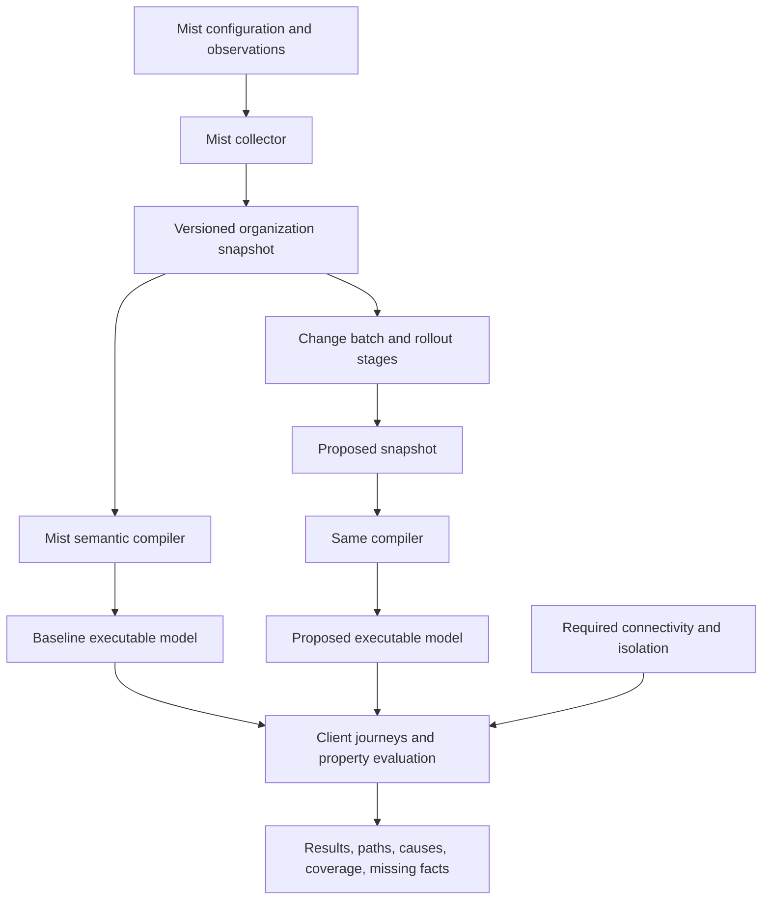

# Full stack Mist digital twin architecture

Build an importable Python **behavioral simulation library**. Compile Mist configuration and observations into small executable models of forwarding, admission, and service dependencies. Compose those models across the organization, apply a complete change batch to an independent snapshot, and evaluate a small set of properties against the resulting behavior.

This changes the unit of implementation from **one detector per problem** to **one model per network mechanism**. A NAC assignment, WLAN forwarding mode, trunk, route, and firewall compose into a client journey. A broken journey supplies its own failure trace. Adding a new combination of existing mechanisms should not require a new detector.

The existing code remains useful for Mist collection, compilation, confidence, replay, and explanations. Introduce the new engine separately and compare it with the current engine before replacing its verdict path. The [first behavioral implementation milestone](behavioral-engine.md) now provides the importable snapshot, batch, coverage and symbolic-program foundation plus bounded EX/SRX/SSR primitives. The complete full-stack engine remains proposed, and production Mist compilation is not implemented.

The [October coverage audit](full-stack-twin-audit.md) records reproduced bypasses, corrected guard behavior, a complete inventory of organization/site mutation endpoints in the pinned specification, and required OSPF/BGP/EVPN and full stack validation cases. Its coverage contract below is a prerequisite for positive semantic results.

The [Juniper device documentation study](juniper-device-semantics-research.md) maps EX, SRX, and SSR behavior to candidate Mist inputs and proposed validation cases. It identifies public Junos YANG references, vendor-specific forwarding/state semantics, and missing-fact boundaries. The implementation guide distinguishes the tested primitive subset from the remaining research backlog.

## Requirements and meaning of a true twin

The owner wants Wi-Fi, switching, SD-WAN, NAC, and Mist Edges; changes across domains and sites; local testing against their own organization; and a module other applications can import. **Use Mist APIs only for production inputs at this stage.** No device SSH, external configuration imports, identity-provider queries, or manually supplied client capability database is assumed.

A useful twin must reproduce the modeled network's behavior, including dependencies and state, and show how its baseline agrees with observations. A topology diagram plus individual lint rules cannot meet that definition. Conversely, an exact prediction of every physical, firmware, identity-provider, and application outcome is not achievable from exposed configuration alone. The product must state the feature, input, environment, and time bounds of each conclusion.

The practical target is a **synchronized behavioral twin with explicit fidelity**. It can establish deterministic failures and isolation violations within supported semantics. It can identify uncertain outcomes where a missing input changes the result. It must not promise complete coverage of every possible user experience issue.

The fundamental work cannot disappear: a compiler still needs to know what a configuration field means. OpenAPI provides shapes, references, descriptions, and endpoints; it does not supply an executable AP, RADIUS service, SSR, or Junos implementation. The improvement is that protocol and device semantics are reusable, while combinations of failures emerge from composition. This is a bounded engineering program with a published capability matrix, rather than an ever-growing list of named incidents.

## Evidence behind the recommendation

The local specification at `/Users/tmunzer/4_dev/API/mist_openapi/mist.openapi.json` reports version **2609.1.0**, dated **September 7, 2026**, with **762 paths and 2,910 component schemas**. The [API evidence inventory](evidence/mist-api-2609.1.0.json) records its SHA-256, source commit, 49 relevant endpoints, component fields, and inspected installed SDK signatures. The installed project SDK is `mistapi 0.62.0`. Specification availability is evidence about collection possibilities, not proof that the model implements those features.

The repository's committed schema extracts have June provenance and local patches, according to `src/digital_twin/adapters/mist/oas/VERSION`. Do not silently substitute the September specification or assume those patches remain correct. A future compiler change needs an intentional schema refresh and semantic compatibility checks.

The current `ChangePlan` places `site_id` at plan scope. `scope/object_gate.py` and the drivers separate site plans, organization plans, and NAC plans. Site batches already combine some WLAN and switch operations; organization changes fan out to assigned sites. However, NAC is evaluated separately, and there is no combined client onboarding and application-delivery engine. `ir/model.py` has no general forwarding table, firewall session, WAN service path, or Mist Edge tunnel model. Its VLAN lookup uses a numeric VLAN ID inside a site model, which must become contextual for organization-wide simulation.

An [offline probe of the current engine](evidence/existing-engine-probes.json) found:

| Proposed change in the probe | Actual current result | Meaning |
| --- | --- | --- |
| Remove a trunk's required WLAN VLAN | `UNSAFE` | The existing engine detects the lost modeled exit. |
| Disable that WLAN, with no active clients | `SAFE` | Current applicable WLAN properties find no problem; this does not establish business intent. |
| Combine both changes | `REVIEW` | The targeted blackhole disappears; remaining STP confidence prevents a fully positive verdict. |
| Add a NAC operation to the site batch | `UNKNOWN` | The current object gate rejects the mixed scope. |

The original offline suite passed **1,926 tests**, with two live tests deselected. Those tests protect existing behavior; they do not establish full stack fidelity. No live Mist organization was contacted during this study.

The theoretical basis is established. [Header Space Analysis](https://www.usenix.org/conference/nsdi12/technical-sessions/presentation/kazemian) composes packet transformations to analyze reachability, loops, and isolation. [NetKAT](https://www.cs.cornell.edu/~jnfoster/papers/frenetic-netkat.pdf) formalizes filtering, modification, and composition. Applying that approach to Mist, and adding onboarding state machines, is the design proposed here; those papers do not establish Mist support or stateful authentication fidelity.

## Why this approach fits the goal

| Approach | Value | Limitation for this goal | Decision |
| --- | --- | --- | --- |
| Add more issue-specific checks | Easy to extend familiar code | Every interaction creates more detector and attribution work. | Retain existing checks during migration; stop treating this as the full stack architecture. |
| Run virtual network devices | Can expose detailed software behavior | AP RF, cloud NAC, Mist Edge, and all firmware combinations cannot be assumed available as lightweight local images. | Reserve labs for validation if later available; no runtime dependency. |
| Use Batfish as the entire twin | Useful Junos routing and policy analysis | Its advertised platform list does not establish Mist AP, cloud NAC, or SSR semantics; those still need models. | Optional later validation tool, not required by the module. |
| Compose semantic models and evaluate properties | Interactions emerge from the shared execution model; snapshots run offline | Requires validated translation and explicit boundaries around state and unknowns. | Recommended core. |

[Batfish's own documentation](https://github.com/batfish/batfish#supported-network-device-and-operating-system-list) lists Junos EX, QFX, and SRX support. That is platform-level support, not a guarantee for every feature. Its [runtime guidance](https://github.com/batfish/batfish#system-requirements-for-running-batfish) recommends a larger server for analyzing an organization's own network. Do not require it for the local core, and do not create pseudo-Junos configurations for APs or SSRs to imply fidelity.

## Library architecture

Keep a modular Python package and thin CLI/MCP wrappers. A caller can supply an explicit Mist credential context or an already captured immutable snapshot. The simulation core imports neither `mistapi` nor an application's UI, database, or global session.



The proposed module boundaries are:

| Module | Ownership and operations | Dependencies |
| --- | --- | --- |
| `collectors.mist` | `capture()` and refresh; paging, scope, source timestamps, API errors | `mistapi`, snapshot contracts |
| `snapshots` | Immutable raw objects, observations, digests, collection intervals, feature completeness | Contracts; optional storage adapter |
| `compilers.mist` | `compile()` raw, layered and generated configuration into typed executable semantics; emit coverage receipts and opaque features | Snapshots, semantic contracts |
| `semantics` | Packet filters and transformations; forwarding context; admission and service state transitions | Pure contracts |
| `control_plane` | Derive forwarding and service paths under defined routing semantics and external boundary assumptions | Semantic configuration, observations |
| `scenarios` | Client cohorts, joins, renewals, application sessions, failures, time and deployment stages | Snapshots, semantic contracts |
| `engine` | `simulate()` and `compare()` with bounded exploration; dependency closure and caches | Pure model and scenario modules |
| `properties` | Connectivity, isolation, onboarding progress, consistency, resilience, preservation | Engine results, intent |
| `reporting` | Counterexample traces, impact groups, exact changes, unresolved inputs | Results and provenance |

These names are proposed interfaces, not directories claimed to be implemented. A future public API should resemble:

```python
# Proposed API; not implemented by the current package.
snapshot = collector.capture(org_id=org_id)
twin = Twin.compile(snapshot)
result = twin.simulate(batch, journeys=journeys, properties=properties)
```

Publish a versioned result contract and adapters for the existing site verdicts. Other applications import the library rather than launching an MCP server. The collector owns sessions, and the caller controls their lifecycle; simulation operates on snapshots without live network access.

Start with an in-memory model and local snapshot files. SQLite is an optional persistence adapter. Use compact indexes and packet classes before introducing a graph database, distributed services, or a general-purpose SMT solver. A symbolic solver can be added behind the engine seam when interval/set operations cannot express a required property efficiently.

## Modeling behavior instead of enumerating issues

Compile device behavior into a few reusable operations: **select a context, filter, rewrite, forward, encapsulate, decapsulate, replicate, and transition state**. Ordered policy evaluation selects the first applicable enforced rule according to validated vendor semantics. Each operation links back to its source object and field.

The packet context must include more than source and destination IP: address family, protocol and ports, identity and role, tenant/VRF, bridge domain and tag stack, ingress attachment, session state, and outer/inner tunnel headers. A WLAN can deliver the same client packet locally or through a remote Mist Edge; these are different execution paths.

Use contextual identities. A bridge domain is identified by organization, forwarding context, and a scoped VLAN/VNI or other stable segment identifier. Equal VLAN numbers in two sites do not imply a shared broadcast domain. Tunnel decapsulation or a validated fabric mapping can connect them explicitly. Route overlap is evaluated within the relevant VRF or leaking relationship.

For example, compose:

```text
Client capability and WLAN/port admission
  → EAP or MAC authentication transport
  → NAC match and returned attributes
  → client VLAN, role, and attachment
  → local switching OR outer tunnel path and remote decapsulation
  → addressing, gateway, and route selection
  → ordered network/application policy and session handling
  → application endpoint and valid response
```

Changing a NAC label from VLAN 10 to VLAN 20 changes the packet context. If a downstream trunk carries only VLAN 10, the transfer produces no successor. The generic connectivity property fails with the NAC-to-trunk trace. If the same batch updates the trunk and the rest of the journey, the packet continues. There is no separate “NAC VLAN changed while trunk did not” detector.

Admission requires a state model as well as packet transfers. A journey can be at link discovery, association, authentication, admitted-but-unaddressed, addressed, or application session established. DHCP discovery/relay/reply, DNS requests, RADIUS/RadSec transport, certificate validation, captive portal flow, CoA, renewals, and roaming are transitions or prerequisite journeys. An authentication service is reached over the management/source network available **before** admission, not through a VLAN that NAC has yet to grant.

State dependencies can form cycles. For example, a service required to establish a tunnel must be accessible before that tunnel is established. A bounded state exploration exposes lack of progress; do not solve this by declaring every dependency reachable in a static graph.

Forwarding also has a control plane. Compute connected/static routes and explicitly supported routing policies. Derive OSPF/BGP results with a versioned protocol model or isolate the unmodeled region. If convergence fails or external advertisements are unknown, retain the uncertainty. A current RIB observation can calibrate the baseline; it cannot remain authoritative after changing the policy that produced it.

For EVPN, first reproduce or obtain the relevant generated configuration: role/topology choices can allocate addresses and AS numbers and change many devices' routing, VRFs, VLAN/VNI mappings, route targets and port behavior. Prove underlay reachability, control-plane distribution and overlay forwarding separately. A healthy BGP session does not prove a remote prefix or tenant is reachable. The audit defines the promotion cases for OSPF, BGP, route policies, VRFs and fabric generation.

Handle stateful return traffic explicitly. An SRX allowed session, its NAT translation, and its return path are not equivalent to independently permitting the reversed five-tuple. SSR needs tenant/service-aware session establishment and its own forwarding semantics: Juniper describes first-packet metadata and session state used for symmetric forwarding. [SSR architecture](https://www.juniper.net/documentation/us/en/software/session-smart-router/docs/about_128t/index.html). Begin with a documented subset rather than treating every gateway as a generic IP tunnel router.

## The small set of properties

| Property | Question | Generic evidence |
| --- | --- | --- |
| Connectivity | Can this allowed client complete this required service exchange? | Forward, control-service, and response paths; first blocking transition |
| Isolation | Can a forbidden identity or segment reach a protected destination? | A concrete allowed path through the relevant policies |
| Onboarding progress | Can a permitted profile reach the addressed/usable state? | Failing or cyclic state transition, including authentication and DHCP |
| Consistency | Do references, contexts, negotiated parameters, and assigned attributes compose? | Undefined dependency, incompatible constraints, or unusable assignment |
| Resilience | Does the journey still satisfy its contract under declared failures? | Counterexample for link/device/path loss and modeled failover state |
| Change preservation | Which outcomes changed outside the permitted change intent? | Baseline/proposed differential witnesses |

These are property templates over the engine, not a promise that six checks explain every experience issue. Timing or load requires additional bounded semantics; physical RF behavior needs information absent from many snapshots.

Generate routine obligations from configuration: allowed WLAN profiles need a usable delivery path; NAC returned attributes must resolve in their enforcement context; advertised services need declared endpoints; configured authentication transports need their own connectivity. Compare old and new behavior for the supported universe. Allow applications to specify required services, protected destinations, and permitted outcome changes as test intent. That is a simulation query, not an additional non-Mist production data source.

Intent matters. Successfully blocking a formerly authorized user may be the purpose of a change. Baseline preservation alone would call it a regression. Return changed behavior with a witness; use explicit property intent to determine whether that change is a problem. With no intent, report objective failures and outcome deltas without inventing business priorities. Application definitions in Mist help generate queries but do not establish that every client is entitled to every application.

## Coverage and unknown inputs

Production analysis should partition identities, addresses, VLANs, protocol/port ranges, and relevant client capabilities into **behaviorally equivalent classes**. Evaluate classes with symbolic filters and transformations, split them when a policy boundary requires it, and produce a concrete witness from a failing class. A few sampled clients or flows do not establish an all-client result. Current clients provide counts and examples; disconnected and potential clients require profile classes and explicit uncertainty.

Distinguish known nondeterminism from missing knowledge. ECMP choices may all be known; a missing IdP attribute makes a rule outcome uncertain. Maintain possible transitions and justified transitions separately. Unknown higher-priority rules must branch into matching and falling through; simply skipping them can falsely prove an allow. Prove isolation by excluding every possible forbidden path, and required delivery under the declared path-selection quantifier. One possible working path is insufficient for an all-path reliability property.

Report four independent dimensions: evaluated population and scenarios, input completeness/freshness, semantic feature support, and confidence/calibration. Unsupported fields touched by a change, unresolved match grammar, stale critical facts, missing external routes, solver limits, or unexplored rollout states must prevent a globally positive verdict for the affected property.

Enforce this through **compiler coverage receipts**, not a list of checks that happened to run. A receipt binds a model fragment to its source operation/schema and structural paths, resource context, effective inputs/defaults, supported value grammar, platform/firmware/model versions, dependencies, observation validity and validation evidence. Preserve unconsumed configuration as opaque fragments. Scan the full effective baseline and proposed dependency footprint: an unchanged unsupported predicate, profile, routing policy or generated fabric setting can become relevant through a modeled edit.

Before satisfying an obligation, require covered semantics and facts for every relevant fragment and evaluated deployment/scenario class. Exclude an unsupported feature only with a non-interference argument valid for that property in every evaluated stage. Default new fields, enum values, union branches, platforms, opaque CLI and operational actions to unsupported. Action contracts must model assignment/import/reorder/reboot side effects; an empty JSON diff cannot establish that an action is inert. Global metadata ignores, null/absent normalization and list admission are not transferable semantic contracts.

Current observations cannot exhaust the client population. Include configured potential cohorts and disconnected/new clients, and make preservation or intentional removal explicit in the property scope. A zero-client observation does not authorize disabling a service. Preserve uncertain fact identities across repeated reads, and distinguish a possible counterexample from a justified violation.

Preserve definite findings even when other results are unknown. The summary should carry both `proven_violations` and `unresolved_obligations`, rather than hiding a known outage behind a single `UNKNOWN` label. Existing decision enums can remain compatibility views. “All modeled obligations satisfied” always includes the model and scenario scope; it does not mean universally safe.

Observers calibrate baseline assumptions; they are not reusable proposed-state truth. Record whether an observation remains valid under the change, expires, or must be recomputed. In particular, current NAC success, STP forwarding state, dynamically selected port usage, tunnel-up status, and established sessions cannot automatically certify the changed configuration.

## Batched changes and deployment states

A versioned batch needs a target scope **on each operation**: organization, site where applicable, object type and ID, and an expected source revision/digest. The plan also names its snapshot, intent, scenarios, and exploration budget. One batch can combine an organization WLAN template, a switch override in site A, NAC labels/rules, a WAN application policy, and a shared Mist Edge tunnel.

Retain Mist update behavior: a supplied root attribute replaces that root, omitted roots persist, and supported explicit deletion markers remove roots. Do not accidentally deep-merge nested policy or network maps. The current adapter implements this distinction, although some current envelope comments still describe updates as complete object replacement. Resolve that documentation inconsistency in the future contract change.

Simulation should provide three different results:

1. **Final state:** overlay the whole batch, recompile all affected semantics, then evaluate once. Taking the worst of independent per-operation simulations rejects compensating changes and misses interactions.
2. **Deployment:** evaluate prepare, activate, and cleanup stages, including relevant mixed device states. Mist operations are not assumed to be atomic across devices or sites. Prefix checks for an ordered API sequence alone do not cover asynchronous configuration activation.
3. **Rollback:** evaluate the inverse staged plan and retained state. Existing leases, authentication sessions, NAT state, and SSR sessions may survive differently from new connections.

A VLAN migration can add new VLAN carriage and addressing everywhere first, change the admission assignment second, and remove the old path after the transition. The final state may satisfy every property while a different deployment order interrupts users. Allow the same object in different explicit stages; the current one-operation-per-object rule is appropriate for its final-state contract but cannot represent all staged migrations.

Bound mixed-state exploration using dependencies and equivalence, rather than enumerating every subset of thousands of devices. Report which states were examined. An exhausted exploration budget returns unresolved deployment safety, while preserving any witnessed interruption. Do not advertise “safe to deploy” from final-state analysis alone.

## Impact across sites

Build reverse dependencies for both configuration and behavior: templates and variables, site groups and AP selection, NAC labels and enforcement points, bridge domains, routes and route advertisements, services and policy order, tunnels and Mist Edge clusters, and required service journeys.

NAC VLAN labels can use site variables, resolved for the authenticating client's site. A single shared rule can therefore select different VLANs and paths in different sites; a site variable edit can change admission without changing that rule. Register this per-site resolution and both label-to-variable and variable-to-enforcement dependencies. [Documented behavior](https://www.juniper.net/documentation/us/en/software/mist/product-updates/2026/september-9th-2026-updates.html).

The affected set is the closure of dependencies in **both baseline and proposed models**. Include newly introduced references, removed dependencies, prefix overlaps, earlier policy rules that can shadow later ones, and sites using shared control services. A routing or firewall change at a hub affects consumers in sites whose configuration never changed. A Mist Edge can terminate WLANs from multiple sites. Do not equate the blast radius with directly assigned sites.

Use that closure to invalidate compiled components and cached query results. Cache keys include snapshot/config digests, semantic model version, scenarios, and external assumptions. A proof cache must contain its dependency set and coverage. If the closure cannot be established, conservatively expand the scope; missing authorization or inventory still leaves an explicit gap. A small edit has no general bound on its organizational impact.

Only compare and re-evaluate equivalent untouched components after establishing a sound dependency boundary. Changing rule order, route preferences, a wildcard, or a shared variable may invalidate a much larger region than the edited object's references suggest.

## Mist API collection and important caveats

The [machine-readable inventory](evidence/mist-api-2609.1.0.json) contains exact paths and installed SDK signatures. Representative collection groups are:

| Domain | API inputs verified in the local specification | Compiler or accuracy requirement |
| --- | --- | --- |
| Scope and inheritance | Organization sites/devices/profiles; site settings; network/gateway/site/AP/RF derived templates | Resolve assignment, variables, matching, overrides, deletion and defaults; certify each compiled feature. |
| Wireless | `GET /sites/{site_id}/wlans/derived`, wireless clients, derived WX rules | Resolve authentication, client VLAN selection, local/tunneled forwarding, AP scope and wireless policy. |
| Wired | Device config, switch/gateway port statistics, OSPF/BGP observations, EVPN topology | Reconcile physical/LAG/VC/fabric topology with configured forwarding contexts and protocol state. |
| WAN and policy | Organization networks/services/VPNS; site derived service policies; gateway config; peer/path statistics | Distinct SSR and SRX behavior, route selection, NAT, return sessions, tenant mapping and path policy. |
| NAC | Organization rules/tags/settings, registered endpoints (`usermacs`), PSKs, IdP/portal configuration; NAC client events and search | Resolve match semantics, global rule status/order, endpoint/site scope, labels and action attributes; distinguish observed identity from verified credentials. |
| Mist Edge | Organization MX clusters, MX tunnels, MX Edges and stats; WX tunnels | Resolve termination, outer reachability, cluster selection, egress VLANs, redundancy, and authentication proxy/cache services. |

API paths above omit the common `/api/v1` prefix where stated. Availability and response completeness must be checked against the actual organization, cloud, privileges, and device versions.

Important details established by the inspected specification or primary documentation:

- `GET /sites/{site_id}/devices/{device_id}/config_cmd` returns **generated configuration commands**. Its description discusses brownfield incorporation. It is not evidence of the complete applied running configuration.
- `POST /sites/{site_id}/devices/{device_id}/show_route` can trigger route output for SSR, SRX, and switches, delivered through a WebSocket session. Treat this as an optional diagnostic collection mode with explicit capability and resource handling, not a passive GET. It was not invoked during this study.
- `GET /orgs/{org_id}/stats/tunnels/search` defaults to `wxtunnel`; WAN tunnel observations need `type=wan`. Those observations do not describe every SSR session path.
- Derived endpoints provide a baseline oracle, not an offline hypothetical derivation service. Reuse the local inheritance compiler and expand its equivalence tests. The current site equivalence gate explicitly covers only `networks`, `port_usages`, and `vars`.
- NAC `apply_tags` can reference attributes including VLAN, RADIUS values, GBP tags, and session timeout. Matching labels and assigning labels have different roles. A dry-run rule records matches without enforcing its action and processing continues. [NAC policy behavior](https://www.juniper.net/documentation/us/en/software/mist/mist-access/topics/topic-map/access-assurance-auth-policy.html).
- For a centrally tunneled WLAN, the source AP requires an outer management/tunnel path; client VLAN carriage is needed at the termination/egress context. Requiring every tunneled client VLAN on its source AP's switch trunk would be wrong. Encapsulation and firewall requirements depend on the selected mode; Juniper documents L2TPv3 and IPsec cases. [Mist Edge guide](https://www.juniper.net/documentation/us/en/software/mist/mist-edge-guide/mist-edge/topics/topic-map/getting-started.html).

Snapshots must record per-domain completeness, page/cursor coverage, acquisition start/end, observation windows, source modifications/digests, and fetch errors. Mist API collection is not an atomic organization-wide transaction. Detect changed load-bearing objects during collection and retry or report snapshot inconsistency. A single “captured at” timestamp cannot hide a long collection interval or older telemetry.

Use scoped token access through the Python `mistapi` adapter, the selected validated Mist cloud, explicit principal/org scope, bounded requests and pagination, and sanitized errors. Do not introduce local application accounts for a library. If a host application later implements Mist user login, that belongs outside the pure engine and must handle MFA. Do not pass tokens or sessions into reports, snapshots, or simulations. Preserve identifiers consistently during redaction so joins remain valid.

## Fidelity and information that may be missing

Every row below describes target capability, not current implementation. Mist-only gaps are reported instead of silently filled with external data.

| Area | Achievable behavior when required API facts and semantics are complete | Limits or missing facts to expose |
| --- | --- | --- |
| L1 and L2 | VLAN/tag transformation, local bridging, link/PoE admission, LAG/VC, supported STP/fabric behavior | Unmanaged neighbor internals, cabling not observed, platform defaults, opaque additional CLI, hidden applied-state drift |
| L3 and IPv6 | Connected/static and supported dynamic routing, VRFs and leaks, ARP/ND dependencies, forwarding and PMTU paths | External route advertisements, unsupported routing attributes, complete post-change convergence, external routers/firewalls |
| ACL and firewall | Supported ordered predicates, identity/context selection, NAT and session-aware permitted paths | L7 classification, encrypted content, IDP/antivirus verdicts, remote enforcement and unsupported action semantics |
| NAC | Supported labels, statuses/order, returned attributes, authentication transport, fallback and reauthentication state | Actual certificate private-key possession, endpoint trust store, current external IdP/MDM/EDR facts, unavailable cache contents |
| WLAN compatibility | Exposed and validated band/security/roaming/capability compatibility | OS/model fingerprints do not establish full negotiated capabilities or driver behavior; unknown profiles stay uncertain |
| RF | Configuration constraints and measured baseline links; conditional sensitivity analysis where data supports it | Counterfactual coverage, interference, human movement, walls/materials, rate adaptation and proprietary RRM decisions |
| SD-WAN | Supported service/tenant forwarding and declared failover paths; conditional loss/latency thresholds | Future WAN loss/latency, hidden external transit, SSR session details not exposed, unsupported service selection |
| Mist Edge | Outer tunnel reachability, selected termination/egress mapping, supported proxy and redundancy dependencies | Counterfactual load, complete internal state, survivability/cache behavior not observable through available APIs |
| DHCP DNS and portals | Supported bootstrap and control-service paths, configured options and endpoint reachability | Live lease availability, DNS answer changes, external portal/IdP behavior and application correctness |
| QoS and capacity | Configured limits and conditional demand/failure scenarios | Future traffic demand, scheduler/ASIC fidelity and quantitative user experience without suitable measurements |

WPA/security and band changes therefore need a capability cohort model, but current API client identity alone cannot justify a universal compatibility verdict. Juniper also calls out device and driver considerations for 6 GHz security choices. [6 GHz considerations](https://www.juniper.net/documentation/us/en/software/mist/mist-wireless/topics/concept/wi-fi-6e-considerations.html).

The audit revoked the existing engine's benign exceptions for QoS, reboot-time PoE and retry timing. Those mutations now create coverage gaps where behavior is unmodeled. This conservative correction does not supply a QoS, power-lifecycle or AAA timing simulator. Do not carry an L2-only classification into full stack coverage without a stated justification.

Redacted exports require separate fidelity checks. Equality-preserving IP/name pseudonyms do not necessarily preserve subnet membership, prefix matching or substring selection. Removing credentials must produce unknown credential facts, not proof that two removed secrets match. The pure engine's normalized facts and confidential/exportable reporting views must have explicit boundaries.

The first live capture should produce a **missing-input report**, naming each input, why it matters, which properties it blocks, and whether another Mist endpoint or diagnostic can provide it. Only after exhausting Mist APIs should the report recommend an external source for a later phase. API-only limitations are part of the result, not a reason to silently expand this phase's data sources.

## Executable feasibility experiment

`experiments/semantic_twin.py` implements ordered packet transfers, branching on unknown facts, path exploration, loop termination, atomic batch overlays, and the same evaluator for required connectivity and forbidden reachability. `experiments/full_stack_semantics.py` supplies a synthetic two-site projection with shared NAC, simplified forwarding/firewall behavior, and a Mist Edge encapsulation/decapsulation path. Run:

```bash
uv run python -m experiments.full_stack_semantics
uv run pytest tests/experiments/test_semantic_twin.py
```

The [saved experiment results](evidence/semantic-experiment.json) include complete traces. Representative outcomes are:

| Synthetic scenario | Site A Wi-Fi | Site A wired | Site B Wi-Fi |
| --- | --- | --- | --- |
| Baseline | Satisfied | Satisfied | Satisfied |
| Shared NAC changes VLAN 10 to 20 | Violated | Violated | Violated |
| Site A wired path changes to VLAN 20 alone | Violated | Violated | Satisfied |
| NAC plus wired change in A | Satisfied | Satisfied | Violated |
| NAC plus wired changes in both sites | Satisfied | Satisfied | Satisfied |
| Shared firewall blocks the application | Violated | Violated | Violated |
| Wireless capability absent | Unknown | Satisfied | Unknown |
| A tunnels to Mist Edge; local client VLAN removed | Satisfied | Violated | Satisfied |
| Shared Edge egress broken for tunneled WLANs | Violated | Satisfied | Violated |

No scenario-specific issue detector was added to obtain these results. The test suite also verifies an unknown earlier rule, an unknown alternate path, a definite bad path alongside unknowns, isolation, loops, and exploration budget exhaustion.

This demonstrates **composition**, not real vendor fidelity. It uses concrete packets and handwritten normalized inputs; its firewall, router, and NAC are simplified. It has no API adapter, full onboarding state machine, symbolic all-flow coverage, real SSR/SRX session semantics, RF model, or production concurrency/capacity claim. Keep it outside the installed production package until the semantics and import contracts are ready.

## Implementation sequence and completion gates

| Phase | Deliverable | Gate before proceeding |
| --- | --- | --- |
| 1 Semantic contracts and snapshots | Versioned organization snapshot, contextual segment IDs, compiler coverage receipts, per-op action contracts and batches | Repeatable offline capture/replay; incomplete paging, hidden override or relevant unsupported baseline/proposed feature cannot satisfy affected properties. |
| 2 First Mist vertical slice | Locally bridged WLAN plus wired plus NAC VLAN assignment and DHCP/application path | Reproduce the batch migration cases from real Mist-shaped captures; baseline compilation agrees with available derived configuration and observations. |
| 3 Shared termination and multi-site delivery | Mist Edge outer/inner paths, egress, RadSec dependencies, shared consumer closure | Edge cluster change identifies remote affected consumers; local and tunneled WLANs require the correct distinct VLAN paths. |
| 4 Routing and policy semantics | Defined Junos/SRX and SSR subsets, symbolic packet classes, ordered policies, return/session model | No fabricated route from missing external data; all-path quantifiers and isolation tests cover policy boundaries and overlapping prefixes. |
| 5 Lifecycle and deployment | Reauthentication, DHCP renewals, roaming/failures, staged mixed-state and rollback exploration | Final success does not hide a failing deployment stage; state-budget limits remain explicit. |
| 6 Importable release | Stable collector/core/result APIs, CLI example, documentation, measured resource budgets | Another application imports the core without ambient credentials or live network effects; unchanged-component caching matches full recomputation. |

These are dependency-oriented phases, not date or effort estimates. Split or reorder them after the first organization capability census. Preserve current CLI behavior during the transition and put the semantic engine behind an explicit experimental entry point. Move useful lint findings into complementary explanations; the new behavior engine owns composed outcomes.

Acceptance scenarios must include: compensating and interaction-only batches; unmodified sites affected by shared rules; site/VRF reuse of VLAN IDs and overlapping subnets; tunnel-mode changes; unknown higher-priority NAC/firewall predicates; NAC dry-run and fallback; Wi-Fi security incompatibility; failed AAA bootstrap; stateful response/NAT behavior; permitted versus forbidden service outcomes; EVPN/route boundaries outside the supported subset; rollout race and rollback; changed observations invalidated; and missing pages, stale facts, or exhausted exploration. Validate explanations against actual paths and source fields, not only expected decision labels.

Baseline calibration can use Mist-derived configuration, telemetry/events, and optional API diagnostics. Real proposed-state outcome validation requires an isolated lab or separately authorized controlled changes; a read-only capture cannot establish counterfactual vendor correctness. Record which semantic features have unit, differential, and live evidence, and do not promote a whole platform based on one successful example.

Apply the [audit's validation workflow](full-stack-twin-audit.md#validation-workflow-and-release-gates) to every registered field/action context. Require shape/default/deletion and activation mutations, independent mechanism oracles, composed batches and rollout cases, symbolic-versus-concrete differential tests, and incremental-versus-full recomputation. An inventory entry needs an explicit disposition before release; a supported disposition additionally needs behavioral evidence. Unsupported dispositions must block affected positive results at runtime.

## Keeping the module lightweight

Represent many clients as exact behavioral cohorts, share compiled templates, store immutable indexed snapshots, and expand only properties and failure scenarios relevant to the batch. Use structural sharing between baseline and proposed state; avoid copying every client for each operation. Route/policy changes may still require broad recomputation, so correctness takes precedence over an incremental fast path.

As an initial **unmeasured acceptance target**, benchmark an offline synthetic organization of 10 sites, 200 devices, 2,000 client observations grouped into justified cohorts, and 1,000 property queries. Aim for peak memory below 2 GB and warm batch evaluation below five seconds on the owner's laptop. Measure cold compilation and API acquisition separately. Count model states and class splits, bound them, and return an incomplete result when limits are reached. These are targets, not performance claims or established capacity limits.

Large policy interactions or routing convergence can defeat cohort compression. Use the same importable interfaces with a worker in a host application if needed; a central service is an optional deployment, not part of the first local core. Do not add mandatory Docker, a device VM fleet, or an LLM to establish deterministic verdicts. An assistant can propose plans or explain traces, but the library's conclusions must come from executable semantics and explicit input evidence.

## Recommended decision

Keep the current Mist integration and trusted supporting code. Start a separate semantic engine and validate the first **NAC plus wireless plus wired** journey against Mist-only snapshots. Add shared Mist Edge and WAN behavior through the same transfer/state interfaces. Expand supported **mechanisms**, and derive failures through a small property vocabulary.

The research question is answered at architecture and feasibility level: this approach can capture cross-domain interactions without a detector for each failure combination. The outstanding engineering work is the Mist semantic compiler, its validation corpus, symbolic/stateful execution, and the published accuracy envelope. Those remain explicit implementation work, not features supplied by OpenAPI or by the experiment.
