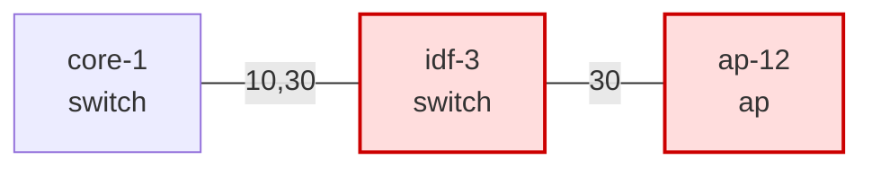

# Topology visualization — mermaid charts of findings on the network graph

Status: **designed** (spec) · 2026-06-17

## Summary

The twin returns a verdict (decision + findings) but no *picture* of where the
predicted breakage lands. This feature emits **mermaid** charts of the network
topology — L2, per-VLAN, and routed-VLAN-exits (L3) — with the **affected nodes
highlighted by severity**, so an approver reading the elicitation UI can see, at
a glance, which devices/VLANs the change breaks and why.

The twin stays pure/text: it produces mermaid *source*; the elicitation UI (or
any markdown renderer) draws it. Most of the hard part already exists — the
graph builders (`build_l2_graph`, `build_vlan_graph`), the IR, and findings that
already carry `subject` (blast radius) and `caused_by` (the changed cause).

## Goals / non-goals

**Goals (v1)**
- One **annotated proposed-state** chart per view, generated on **every** run
  (even a clean SAFE — consistent topology context).
- Three views: **L2 topology**, **one chart per VLAN**, **Routed VLAN exits**.
- Highlight the **blast radius** (what breaks) severity-colored, with inline
  finding labels; surface the **cause** (`caused_by`) in captions/comments.
- Expose as a structured `Verdict.diagrams` list + a markdown helper for the UI.

**Non-goals (v1 — see Roadmap)**
- Before/after (baseline vs proposed) pairs; diff-overlay charts.
- Drawing the *removed/cut* link that caused a severance (needs baseline
  overlay).
- Rendering to images (SVG/PNG) — we emit mermaid source only.
- Edge/`linkStyle` coloring — v1 highlights **nodes** only (link/port findings
  map onto endpoint device nodes).
- OSPF adjacency / area views (the IR does not model that topology yet).

## Decisions (from brainstorming)

| # | Decision |
|---|---|
| Render target | Mermaid **source** in markdown; UI renders. |
| Chart scope | **Full set, every run**: L2 + per-VLAN (each) + Routed VLAN exits. |
| Change depiction | v1 = **single annotated proposed-state** chart per view. |
| Highlight | Severity-colored + inline finding labels; **blast radius only**. Cause goes in captions. |
| Output | Structured `Verdict.diagrams` list + a markdown assembly helper. |
| Placement | New **`viz/` package**; `Diagram` DTO in `contracts/`. |

## Architecture

New package `src/digital_twin/viz/` (pure, no I/O):

```
viz/
  highlight.py   # build_highlight(findings, ir) -> Highlight
  mermaid.py     # build_diagrams(ir, findings) -> tuple[Diagram, ...]  (+ style constants)
  markdown.py    # to_markdown(diagrams) -> str
```

- **`Diagram` is a dumb DTO in `contracts/diagram.py`** (so `verdict/` can hold
  it without importing any mermaid styling):

  ```python
  @dataclass(frozen=True)
  class Diagram:
      view: str               # "l2" | "vlan:<id>" | "l3_exits"
      title: str              # human title, e.g. 'VLAN 30 "voice"'
      severity: Severity | None   # worst severity highlighted here (ordering)
      mermaid: str            # the mermaid source
      notes: tuple[str, ...] = ()  # captions: cause summary, "N findings not localized"
  ```

  Mermaid `classDef`/style constants live in `viz/mermaid.py`, never in the DTO.

- **`Verdict` gains** `diagrams: tuple[Diagram, ...] = ()`.

- **Plug-in point** — `pipeline._simulate_site_state`, after `assemble(...)`:

  ```python
  verdict = replace(verdict, diagrams=safe_build_diagrams(proposed.ir, verdict.findings))
  ```

  Diagrams reflect the **proposed** (resulting) IR. The pipeline stays
  orchestration-only; `assemble()` stays IR-light (it never sees the graph);
  per-site org verdicts get diagrams for free (each is a `Verdict`).

- **Ordering** of the list: L2 first, then VLAN charts (affected first, by worst
  severity desc), then unaffected VLANs (vlan-id asc), then Routed VLAN exits.

## The three charts

All are `graph LR`. Device node ids are **synthetic** (`n0`, `n1`, …) — IR ids
contain `:` `/` `-` `.` which are invalid in mermaid node ids — with the real
(escaped) label carrying the name. A per-chart `classDef` legend defines the
severity classes.

1. **L2 topology** (`view="l2"`) — every device (VC-folded), label
   `name<br/>role`; edges = L2 links, label = carried-VLAN count or
   `trunk`/`LAG`. Highlighted nodes get the severity class.

2. **Per-VLAN** (`view="vlan:<id>"`) — the `build_vlan_graph(vid)` subgraph:
   member devices, **exits** as a distinct shape `([gateway])`, edges carrying
   that VLAN. One chart per VLAN in the IR.

3. **Routed VLAN exits** (`view="l3_exits"`) — a routed-VLAN ↔ serving-L3-
   interface view. Built from **all `ir.l3intfs` grouped by `vlan_id`**
   (including `L3Role.GATEWAY`, which `exits_by_vlan` excludes but `gateway_gap`
   treats as serving) — NOT `exits_by_vlan`. Left = routed VLANs (those with a
   subnet); right = their L3 interfaces (`role` + owning device); edge = "served
   by". Highlight VLANs whose exit is lost (`gateway_gap`, `ospf_withdrawal`).

Example (L2, one stranded node):



## Highlight model

`build_highlight(findings, ir) -> Highlight` produces, per graph entity
(device node / vlan / link), the **worst severity** touching it and the list of
**finding labels** (`code` + short reason). It also collects **cause** lines
(from `caused_by`) and a count of **non-localized** findings, per chart.

**Blast radius vs cause (refinement #4).** Only the *blast radius* is colored:
`subject` + `affected_entities`. **`caused_by` is never colored** — it would
confuse cause with effect — it is rendered as a `%%` mermaid comment / `notes`
caption ("caused by: <ref label> (changed: <fields>)"). Visual cut-link
rendering of the cause is Roadmap.

**Resolver precedence (refinement #3 — typed/evidence-aware).** `affected_entities`
is untyped strings (a `"10"` could be a VLAN; `cycle.member_ports` are port ids).
Resolve each finding to graph entities in this order, first hit wins per entity:

1. **`subject`** (`ObjectRef`, typed `kind`+`id`) — authoritative.
2. **Structured `evidence` keys** — known typed keys per check: `vlan`,
   `device`, `link`, `port`, `component_nodes`, `fragment_nodes`,
   `new_member_ports`, `affected_vlans`, `baseline_root`/`proposed_root`.
3. **`affected_entities`** strings, disambiguated against IR indexes: in
   `ir.devices` → device node; an int in `ir.vlans` → vlan; matches a port id /
   in `ir.ports` → its device node; contains `__` → link → endpoint nodes.

**ID normalization.** Graph nodes are IR device ids (MAC, VC-folded). Check
findings already use IR ids. L0/adapter device `subject`s use the Mist id
`00000000-…-<mac>` → normalize to the trailing MAC. Centralized in `highlight.py`.

**Edges → nodes (refinement #7).** v1 highlights **nodes only** (mermaid edge
classing via `linkStyle` indexes is renderer-fragile). Link findings
(`native_mismatch`, `mtu_mismatch`, `stp_edge`) and port findings resolve to
their **endpoint device nodes**; edges are drawn plain with labels. Edge/cut-link
coloring is Roadmap.

Any finding that resolves to no graph entity (e.g. a pure schema violation) is
**not drawn** but is counted in the chart's `notes` ("N finding(s) not
localized") and remains in `verdict.findings` — nothing is silently dropped.

## Device display name (prerequisite)

The IR `Device` has no `name` today (only `id`/`role`/`site`/`model`), so node
labels would show MACs. Add an optional display name:

- `Device.name: str | None = None` on the IR entity.
- `SwitchIngester` populates it from the raw device `name`.
- Node label = `name if present else id` + `<br/>role`.

This also **re-enables device-subject finding names**: `checks/subjects.py`
`_name_for("device")` (which today returns None — `model` was rejected as a
non-identity) returns `Device.name`, so device-subject findings render the real
name instead of the MAC. (Closes the deferred item from the subject PR review.)

## Output / integration

- `verdict_to_dict` serializes `diagrams` automatically (dataclass list →
  dicts), so the MCP `simulate_change` JSON the agent/elicitation receives
  already contains the charts.
- `drivers/render.py` gains `render_diagrams_markdown(verdict) -> str` =
  `to_markdown(verdict.diagrams)` — the paste-ready blob of `##`-headed
  ```mermaid blocks (+ `notes` as captions). `render_human` lists diagram
  **titles** only (not the full source).
- `OrgVerdict`: per-site verdicts carry their own diagrams; an org-level
  aggregate view is Roadmap.

## Error handling

Diagrams are **presentational** and must never change a decision or sink a
verdict.

- `build_diagrams(ir, findings)` is **pure and may raise** (so unit tests catch
  real rendering bugs — refinement #5).
- The pipeline calls a thin **`safe_build_diagrams(ir, findings)`** wrapper that
  catches any exception and returns `()` (and is the ONLY place that swallows).
  Tests call the pure `build_diagrams` directly.

## Testing (TDD)

- `build_highlight`: resolver precedence (subject > evidence > affected_entities),
  ID normalization (Mist id → MAC), worst-severity-wins, cause lines collected
  but not in the highlight set, non-localized counting.
- `build_diagrams`: a finding's blast-radius node carries the right severity
  class + label; `caused_by` appears as a comment/caption, NOT a class; link/port
  findings color endpoint nodes; the routed-exits chart includes a GATEWAY-role
  interface; structural mermaid invariants (every `class` target node declared;
  `classDef`s present; synthetic ids only).
- `to_markdown`: fenced ```mermaid blocks, titles, notes captions.
- pipeline: a non-SAFE verdict carries highlighted diagrams; a clean SAFE
  carries the full set with nothing classed; `safe_build_diagrams` swallows a
  forced builder error → `diagrams=()`, decision unchanged.
- `Device.name` ingest + `_name_for("device")` returns the name.

## Dependencies & sequencing

- **Consumes the cause-attribution feature** (`Finding.caused_by`, `Cause`,
  `analysis/delta_cause`) — present on `origin/main` (spec
  `2026-06-16-finding-cause-attribution-design.md`). This branch is based on
  `origin/main`. `caused_by` is read-only here; no change to that feature.
- Touches `checks/subjects.py` (`_name_for` device branch) — a file the
  cause-attribution work also edits; coordinate to avoid a merge clash (the
  change here is a 1-line re-enable gated on `Device.name`).

## Roadmap (deferred — also recorded in docs/ROADMAP.md)

- Before/after (baseline vs proposed) chart pairs.
- Diff-overlay charts (added=green / removed=red-dashed / affected=highlighted).
- Visual **cut-link** rendering of `caused_by` (needs baseline overlay) +
  edge/`linkStyle` coloring.
- Image rendering (SVG/PNG) for UIs that can't run mermaid.
- Org-level aggregate topology across sites.
- OSPF adjacency / routing-area views (once the IR models them).
